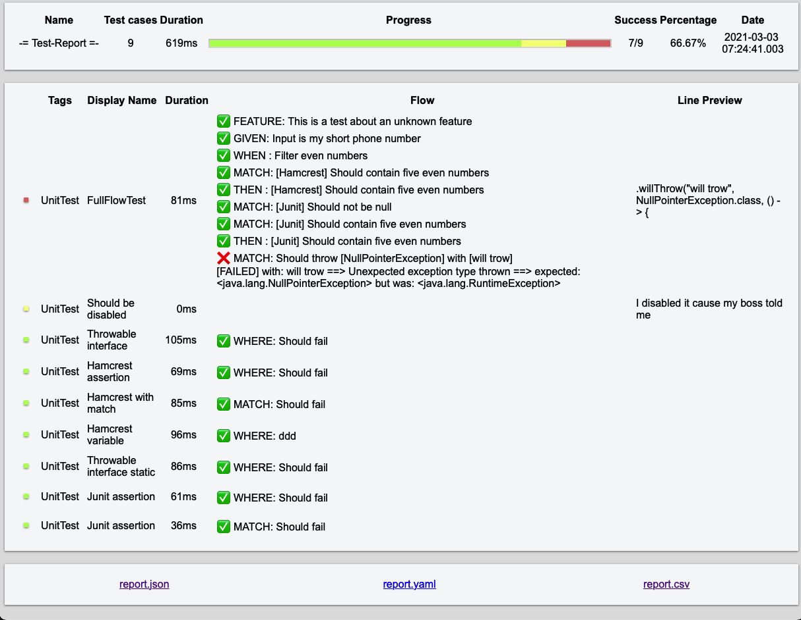

# Wiser Unit


[![Build][build_shield]][build_link]
[![Maintainable][maintainable_shield]][maintainable_link]
[![Issues][issues_shield]][issues_link]
[![Commit][commit_shield]][commit_link]
[![Dependencies][dependency_shield]][dependency_link]
[![License][license_shield]][license_link]
[![Central][central_shield]][central_link]
[![Tag][tag_shield]][tag_link]
[![Javadoc][javadoc_shield]][javadoc_link]
[![Size][size_shield]][size_shield]
![Label][label_shield]

[build_shield]: https://github.com/YunaBraska/wiser-unit/workflows/JAVA_CI/badge.svg
[build_link]: https://github.com/YunaBraska/wiser-unit/actions?query=workflow%3AJAVA_CI
[maintainable_shield]: https://img.shields.io/codeclimate/maintainability/YunaBraska/wiser-unit?style=flat-square
[maintainable_link]: https://codeclimate.com/github/YunaBraska/wiser-unit/maintainability
[coverage_shield]: https://img.shields.io/codeclimate/coverage/YunaBraska/wiser-unit?style=flat-square
[coverage_link]: https://codeclimate.com/github/YunaBraska/wiser-unit/test_coverage
[issues_shield]: https://img.shields.io/github/issues/YunaBraska/wiser-unit?style=flat-square
[issues_link]: https://github.com/YunaBraska/wiser-unit/commits/master
[commit_shield]: https://img.shields.io/github/last-commit/YunaBraska/wiser-unit?style=flat-square
[commit_link]: https://github.com/YunaBraska/wiser-unit/issues
[license_shield]: https://img.shields.io/github/license/YunaBraska/wiser-unit?style=flat-square
[license_link]: https://github.com/YunaBraska/wiser-unit/blob/master/LICENSE
[dependency_shield]: https://img.shields.io/librariesio/github/YunaBraska/wiser-unit?style=flat-square
[dependency_link]: https://libraries.io/github/YunaBraska/wiser-unit
[central_shield]: https://img.shields.io/maven-central/v/berlin.yuna/wiser-unit?style=flat-square
[central_link]:https://search.maven.org/artifact/berlin.yuna/wiser-unit
[tag_shield]: https://img.shields.io/github/v/tag/YunaBraska/wiser-unit?style=flat-square
[tag_link]: https://github.com/YunaBraska/wiser-unit/releases
[javadoc_shield]: https://javadoc.io/badge2/berlin.yuna/wiser-unit/javadoc.svg?style=flat-square
[javadoc_link]: https://javadoc.io/doc/berlin.yuna/wiser-unit
[size_shield]: https://img.shields.io/github/repo-size/YunaBraska/wiser-unit?style=flat-square
[label_shield]: https://img.shields.io/badge/Yuna-QueenInside-blueviolet?style=flat-square
[gitter_shield]: https://img.shields.io/gitter/room/YunaBraska/wiser-unit?style=flat-square
[gitter_link]: https://gitter.im/wiser-unit/Lobby


### Description
BDD test methods and generates report

### Features
* Provides BDD methods \[SUMMARY, FEATURE, GIVEN, THEN, WHEN, AND, BUT, WHERE, MATCH]
* Provides BDD error message with preconditions
* Provides a preview of the error line
* Report generation in \[JSON, YAML, HTML, CSV]
* \[...] your feature request?

### Configuration
* Config `wiser_report.yaml` (can be placed at the root folder of the project):
```yaml
name: "Custom report name"
generateYaml: true #generates yaml report
generateHtml: true #generates html report
generateCsv: true #generates csv report
generateJson: true #cant be disabled, it always generates a json report
generateNew: true #[false: update current report (parallel tests) / true: delete previous]
generateFlow: true #[will also generates flow for successful tests using regex]
errorPreviewLines: 1 #Class lines to preview when error occurred
outputDir: "%user.dir%/target/wiser-report.out" #report output, empty string = disabled
classesIgnore: "MyAnnoyingClassName" #Will ignore the class while scanning for error line/preview
```

### Usage report
* `@WiserJunitReport` annotation adds the class test to the report generator 
```java
@Tag("UnitTest")
@WiserJunitReport
class MyTest {
    //....
}
```
### Usage BDD methods
* Basic example
```java
.given("Input is my short phone number", 10)
.when(
    "Filter even numbers", 
    number -> LongStream.rangeClosed(1, number).boxed().filter(value -> value % 2 == 0).collect(toList())
).then(...)
```

* Junit assertions
```java
.then(
    "[Junit] Should contain five even numbers", 
    value -> {
        assertNotNull(value);
        assertEquals(5, value.size());
        return value;
    }
)
```
```java
.match(
    "[Junit] Should not be null", 
    Assertions::assertNotNull
)
```
```java
.match(
    "[Junit] Should contain five even numbers", 
    value -> {
        assertNotNull(value);
        assertEquals(5, value.size());
    }
);
```
```java
.willThrow(RuntimeException.class, () -> {
    throw new RuntimeException("expected");
});
```
* Hamcrest
```java
.match(
    "[Hamcrest] Should contain five even numbers",
    is(notNullValue()),
    hasSize(5)
);
```
```java
.then(
    "[Hamcrest] Should contain five even numbers", 
    value -> {
        assertThat(value, is(notNullValue()));
        assertThat(value, hasSize(5));
        return value;
});
```

### Example failed test
```
berlin.yuna.wiserjunit.model.exception.BddException: 
✅ FEATURE: This is a test about an unknown feature
✅ GIVEN: Input is my short phone number
✅ WHEN : Filter even numbers
✅ MATCH: [Hamcrest] Should contain five even numbers
✅ THEN : [Hamcrest] Should contain five even numbers
✅ MATCH: [Junit] Should not be null
✅ MATCH: [Junit] Should contain five even numbers
✅ THEN : [Junit] Should contain five even numbers
❌ MATCH: Should throw [RuntimeException]
   [FAILED] with: Unexpected exception type thrown
        
    at berlin.yuna.wiserjunit.model.bdd.BddCore.renderException(BddCore.java:155)
[...]
```
### Example Report
